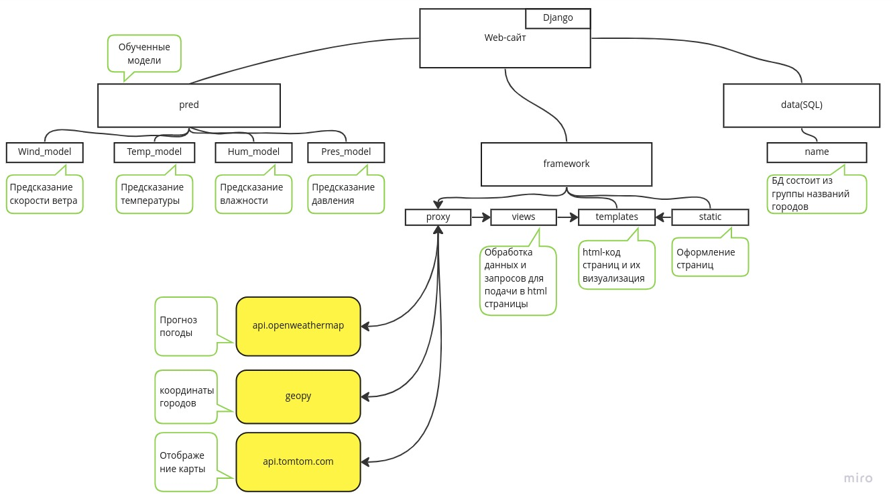

Neuron_training заархивированы, тк github не разрешает пушить файлы, больше 100мб(((  

# Прогноз погоды на сегодня с предсказанием на завтра

## Архитектура платформы

## Примеры используемых паттернов

### Поведенческие:

 - Цепочка обязанностей(chain of responsibility) - разделение между функциями обращений к api, нейронной сети и основных функций

### Структурные:

 - Посредник(proxy) - обращение к api(функции api_reg.py)

### Порождающие

 - Строитель(builder) - class django.db.models.Models(models.py)(в данном проекте он еще и Одиночка(singleton))

### Зоны ответственности

Дегтярев Денис Андреевич, М8О-207Б-21: frontend, backend, БД, docker.  
Меркулов Федор Алексеевич, М8О-207Б-21: machine learner.

### Docker

6858676/web_weather
